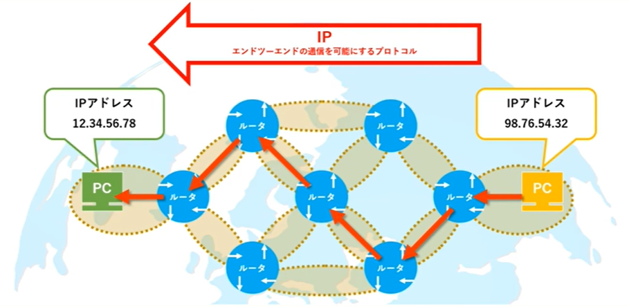

<head>
  <style>
    /* インラインコードの色を変更する */
    code {
      color: #F15A22;
    }
    table {
        font-size: 60%;
    }
  </style>
</head>

# 社内ネットワーク<br>について

note:最近、お問合せ対応の際にネットワークの知識がなくて困るシーンがあったので、ネットワークについて整理した。ネットワーク全般のことを扱うことはできないので、いくつかのテーマをピックアップしてお話します。

---

## 目次

- 社内のネットワーク
- IP
- DNS
- トラブル対応

---

## 社内のネットワークへの<br>アクセス

--

### 超簡易図


note:異なるネットワークを相互接続してくれるルーター、そしてインターネットを介してつながっている<br>
当社のルーター：SOPHOS<br>
では、なぜこのような接続ができているのか

--

## 送信元・送信先の情報


note:TCP/IPモデルはこの後もでてくる<br>
データに送信元と送信先の情報をくっつけてやりとりをしている<br>
今日はIPについて話す

---

## IP

--

### IPとは

- Internet Protocol
- インターネット通信に関するプロトコル<br>（ルール）
- `IPアドレス`を使用してエンドツーエンドの<br>通信を可能にする

--

### IPアドレスとは

- ネットワーク上の機器に割り当てられるインターネット上の「住所」のような存在
- ネットワーク上でデータを送受信する際に使われる



--

### IPアドレス


note:ローカル：自分のパソコンで作成した書類をプリンターで出力するとき<br>
グローバル：ネットでGoogleにアクセスするとき<br>
社内ネットワークに接続しているPCは全て同じグローバルIPアドレスになる

--

### グローバルIPアドレスの確認

「グローバルIPアドレス」「確認君」検索

note:以前丸山さんに教えていただいたやつ

--

### グローバルIPアドレスの確認

<p style="font-size: 25px; text-align: center;">会社から確認</p>

<p style="font-size: 25px; text-align: center;">自宅から確認</p>


note:【使い方】リモートワークの方が社内のネットワークに接続できているか確認したいとき（グローバルIPアドレスが自分と同じなら◎）

--

### プライベートIPアドレスの確認

Linux 標準の ネットワークツール
```
ifconfig
```
Windows 標準の ネットワークツール
```
ipconfig
```

note:コマンドで確認する方法

--

### プライベートIPアドレスの確認（Mac）

システム環境設定 > ネットワーク

--

### プライベートIPアドレスの確認（Mac）

システム環境設定 > ネットワーク > Ethernet

--

### プライベートIPアドレスの確認（Mac）

システム環境設定 > ネットワーク > wi-fi

note:ルータのIPアドレスが違う

--

### アドレスクラス


note:ネットワーク部とホスト部の割合によってパターンが分かれている（第一オクテット）<br>
Ethernetは192.168.3のグループ、2階のwi-fiは192.168.2のグループに割り振られている<br>
【疑問】2のグループとか3のグループってなに？

--

### ネットワークをまたぐ通信


デフォルトゲートウェイ {.fragment .fade-down}

note:【回答】区切られた別々のネットワーク<br>
【疑問】どうやりとりしているの<br>
【回答】ルータを介してやり取りする<br>
ネットワークにおける出入り口にあたる端末のことをデフォルトゲートウェイという<br>
ゲートウェイ＝出入り口<br>
ルータは複数のポートをもっていて、それぞれ１つのノードとしてIPアドレスを持つことができる<br>
それぞれのネットワークにおけるデフォルトゲートウェイは、それが刺さっているポートのIPアドレスになる

--

### ネットワークをまたぐ通信


note:各ノードは自分のデフォルトゲートウェイのIPアドレスを保存している<br>
送り先のIPアドレスの情報が自分のネットワーク内になければ、外部の世界にいくために自分のデフォルトゲートウェイに送る<br>
ルータは宛先の情報から別のデフォルトゲートウェイに情報を送って、宛先ノードにたどりつく<br>
このように社内の別のネットワークやり取りができる

---

## DNS

note:いつも使っているけれどさほど意識することのないDNSについてお話します

--

### DNSとは
- Domain Name System
- IPアドレスとドメイン名の相互変換を行うシステム
    - `名前解決`


note:IPアドレスとドメイン名の紐付けを管理することを、名前解決という

--

### DNS
 <br>

|            | プライベートDNS                              | パブリックDNS                            |
| ---------- | -------------------------------------------- | ---------------------------------------- |
| 説明       | 個人や企業内で独自に運用する | インターネットを通じて<br>誰でも自由に利用できる             |
| IPアドレス | 192.168.2.184   <br>（当社）                     | 8.8.8.8    <br> （Google）                   |
| ドメイン   | https://knowledge.core.king    <br> （社報）     | https://redmine.kingprinters.com  <br> （社報）|

note:【使い方】パブリックDNSを利用したドメイン名の方にアクセスできるけど、プライベートDNSを利用したドメイン名の方にアクセスできなかったら、プライベートDNSで名前解決ができていないと分かる

--

### DNSの設定(Mac)

- システム環境設定 > ネットワーク

---

## トラブル対応

--

### トラブル対応手順

➀問題の切り分け
➁原因調査
➂対処

note:問題の切り分けがめちゃくちゃ難しい！それを助けてくれるプロトコルを紹介します

--

### ICMP


note:TCP/IPモデル

--

### ICMPとは

-  Internet Control Message Protocol
- エラー通知や問い合わせ情報を転送するためのプロトコル


note:IPはアクシデントに見舞われてもなにも言わないし、調査も難しいもの<br>
それを補ってくれるのがICMPで、状況確認を助けてくれる<br>
次に、実際にどう助けてくれるのかみていく

--

### ping

- ICMPプロトコルを使用したネットワークの診断プログラム
- ネットワークの疎通を確認


note:やっほ～！はいは～い！

--

### pingの使い方

宛先：「ホスト名」または「IPアドレス」
```
ping [宛先]
```
Googleのホストドメインでテスト
```
ping www.google.co.jp
```

--

### pingの使い方

draw.ioをもう一度のせる

ルーターまでちゃんとこれてるかな？

```
ping 113.37.168.66
```

--

### traceroute

- ICMPプロトコルを使用したネットワークの診断プログラム
- trace「追跡する」+route「経路、道筋」
  - 通信経路を追跡する
- 特定のノードまでの経路情報を取得するコマンド


note:最終地点じゃなければ次へ進む、最終地点なら完了を返す

--

### tracerouteの使い方

宛先：「ホスト名」または「IPアドレス」
```
traceroute [宛先]
```
Google DNS サーバーでテスト
```
traceroute 8.8.8.8
```

--

### tracerouteの使い方

draw.ioをもう一度のせる

社内のDNSサーバーまでの経路を確認

```
traceroute 192.168.2.184
```

--

### トラブル対応手順

➀問題の切り分け
➁原因調査
➂対処

→通信経路の理解＆IPアドレスの特定をしよう！

note:問題の切り分けって難しい！と言いましたが、通信経路の理解やIPアドレスの特定をしていくことで、整理することはできます。みなさんの参考になれば幸いです。


---

ご清聴ありがとうございました！
